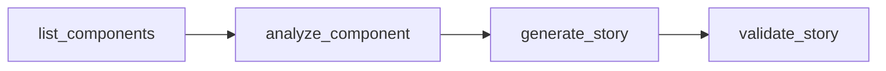
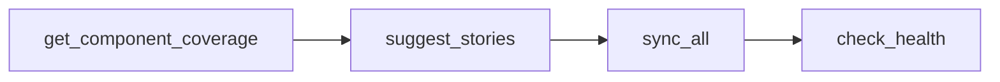

## Available Tools

Storybook MCP provides 13 powerful tools for managing your Storybook workflow:

<CardGroup cols={2}>
  <Card
    title="list_components"
    icon="list"
    href="/api-reference/list-components"
  >
    List and filter React components by library or story status
  </Card>
  <Card
    title="analyze_component"
    icon="magnifying-glass"
    href="/api-reference/analyze-component"
  >
    Extract props, dependencies, and get intelligent suggestions
  </Card>
  <Card
    title="generate_story"
    icon="wand-magic-sparkles"
    href="/api-reference/generate-story"
  >
    Generate complete story files with variants and tests
  </Card>
  <Card
    title="generate_test"
    icon="flask"
    href="/api-reference/generate-test"
    color="#FF4785"
  >
    Generate Playwright/Vitest tests (Pro)
  </Card>
  <Card
    title="generate_docs"
    icon="book"
    href="/api-reference/generate-docs"
    color="#FF4785"
  >
    Generate MDX documentation (Pro)
  </Card>
  <Card
    title="validate_story"
    icon="check-circle"
    href="/api-reference/validate-story"
  >
    Check stories for best practices and issues
  </Card>
  <Card
    title="sync_all"
    icon="arrows-rotate"
    href="/api-reference/sync-all"
  >
    Sync all components at once
  </Card>
  <Card
    title="sync_component"
    icon="arrow-rotate-right"
    href="/api-reference/sync-component"
  >
    Sync a single component's story/test/docs
  </Card>
  <Card
    title="get_component_coverage"
    icon="chart-pie"
    href="/api-reference/get-component-coverage"
  >
    Get story coverage statistics
  </Card>
  <Card
    title="suggest_stories"
    icon="lightbulb"
    href="/api-reference/suggest-stories"
  >
    Get prioritized list of components needing stories
  </Card>
  <Card
    title="check_health"
    icon="heart-pulse"
    href="/api-reference/check-health"
  >
    Check Storybook installation health
  </Card>
</CardGroup>

## Tool Categories

<Tabs>
  <Tab title="Discovery">
    Tools for finding and analyzing components:
    - `list_components` - Find all components
    - `analyze_component` - Deep analysis
    - `get_component_coverage` - Coverage stats
    - `suggest_stories` - Intelligent suggestions
  </Tab>

  <Tab title="Generation">
    Tools for creating stories, tests, and docs:
    - `generate_story` - Story files
    - `generate_test` - Test files (Pro)
    - `generate_docs` - MDX documentation (Pro)
    - `sync_all` - Batch generation
    - `sync_component` - Single component sync
  </Tab>

  <Tab title="Validation">
    Tools for checking quality:
    - `validate_story` - Story best practices
    - `check_health` - Installation diagnostics
  </Tab>
</Tabs>

## License Tiers

<Info>
  Some tools require a Pro license. See [Pricing](/license/pricing) for details.
</Info>

<ResponseField name="Free Tier" type="Features">
  <Expandable title="Available Tools">
    - ✅ list_components
    - ✅ analyze_component
    - ✅ generate_story (basic template only)
    - ✅ validate_story
    - ✅ get_component_coverage
    - ✅ suggest_stories
    - ✅ check_health
    - ⚠️ sync_all (max 5 components)
  </Expandable>
</ResponseField>

<ResponseField name="Pro Tier - $49" type="Features">
  <Expandable title="All Tools + Advanced Features">
    - ✅ All free tier tools
    - ✅ generate_test (Playwright/Vitest)
    - ✅ generate_docs (MDX)
    - ✅ All story templates
    - ✅ Unlimited sync
    - ✅ Priority support
  </Expandable>
</ResponseField>

## Common Patterns

### Component Discovery Workflow



1. **List** components without stories
2. **Analyze** component structure
3. **Generate** stories with appropriate template
4. **Validate** generated stories

### Batch Generation Workflow



1. **Check** current coverage
2. **Get** suggestions for components needing stories
3. **Sync** all at once
4. **Verify** installation health

## Response Format

All tools return JSON responses with consistent structure:

```json
{
  "result": { /* Tool-specific data */ },
  "summary": "Human-readable summary",
  "error": null // or error message
}
```

## Error Handling

Tools use structured error codes for programmatic handling:

| Code | Category | Description |
|------|----------|-------------|
| 1000-1099 | File System | Component not found, file read/write errors |
| 2000-2099 | License | Feature requires Pro, license validation failed |
| 3000-3099 | Configuration | Invalid config, missing library |
| 4000-4099 | Analysis | Parse error, invalid component |
| 5000-5099 | Generation | Template not found, generation failed |

See [Error Handling Guide](/advanced/error-handling) for details.
