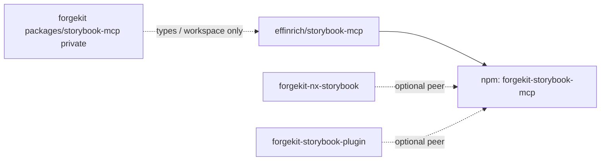

This repository is the **canonical** home for the npm package **`forgekit-storybook-mcp`** ([GitHub](https://github.com/effinrich/storybook-mcp)). Some clones are named `storybook-mcp-v2` for historical reasons; the published name is unchanged.

## Related packages

- **ForgeKit monorepo mirror** — `packages/storybook-mcp` under [`effinrich/forgekit`](https://github.com/effinrich/forgekit) is **`"private": true`**. It exists for workspace consumers (for example `context-mcp`) and must not be published as a competing `forgekit-storybook-mcp`. Full map: [`forgekit/docs/package-lineage.md`](https://github.com/effinrich/forgekit/blob/main/docs/package-lineage.md).

- **Nx** — [`@effinrich/forgekit-nx-storybook`](https://github.com/effinrich/forgekit-nx-storybook) is Nx-specific glue; **`forgekit-storybook-mcp`** is listed as an optional peer for alignment with this engine.

- **Legacy CLI** — [`forgekit-storybook-plugin`](https://www.npmjs.com/package/forgekit-storybook-plugin) overlaps conceptually; optional peer **`forgekit-storybook-mcp`** documents the preferred path for new work.

